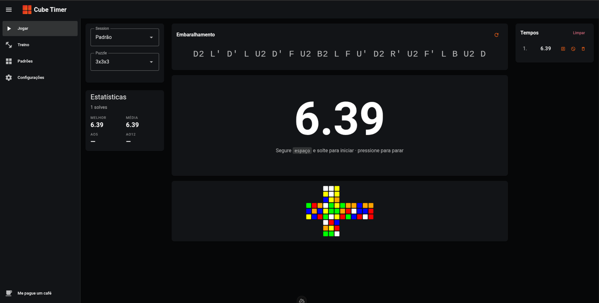

# Cube Trainer

Um timer de speedcubing para cubo mágico, feito para rodar 100% no navegador. Cronometre suas resoluções, gere embaralhamentos oficiais e acompanhe suas estatísticas — tudo salvo localmente, sem precisar de conta ou servidor.

## Captura de tela



## Funcionalidades

- ⏱️ **Timer** controlado por barra de espaço (segure para armar) ou toque na tela
- 🔀 **Embaralhamentos** gerados automaticamente para 2x2, 3x3 e megaminx (com visualização do cubo no 3x3)
- 📊 **Estatísticas WCA** — melhor tempo, média de 5/12, média geral (descartando melhor e pior), além de um dashboard com gráficos e streaks
- 🏷️ **Penalidades** `+2` e `DNF`
- 🗂️ **Sessões** para organizar suas resoluções
- 📜 **Histórico** de resoluções
- 💾 **Armazenamento local** via IndexedDB (seus dados nunca saem do seu dispositivo)
- 📱 **PWA** — instalável e funciona offline
- 🌐 **i18n** — Português e Inglês
- 🎨 **Tema** claro/escuro (Vuetify Material Design 3)

## Tecnologias

- [Nuxt 4](https://nuxt.com/) + [Vue 3](https://vuejs.org/) (Composition API)
- [Vuetify 4](https://vuetifyjs.com/) (blueprint `md3`)
- [Pinia](https://pinia.vuejs.org/) para estado
- [IndexedDB](https://developer.mozilla.org/docs/Web/API/IndexedDB_API) para persistência
- PWA via [`@vite-pwa/nuxt`](https://vite-pwa-org.netlify.app/) e i18n via [`@nuxtjs/i18n`](https://i18n.nuxtjs.org/)

## Começando

Requer [Node.js](https://nodejs.org/) e [pnpm](https://pnpm.io/).

```bash
# Instalar dependências
pnpm install

# Servidor de desenvolvimento em http://localhost:3000
pnpm dev
```

## Scripts

| Comando         | Descrição                                    |
| --------------- | -------------------------------------------- |
| `pnpm dev`      | Servidor de desenvolvimento (localhost:3000) |
| `pnpm build`    | Build de produção                            |
| `pnpm generate` | Geração do site estático (SSG)               |
| `pnpm preview`  | Pré-visualiza o build de produção            |

## Estrutura do projeto

```
lib/            Código independente de framework (sem Nuxt/Vue)
  cube/         Engine do cubo (embaralhamento e renderização do 3x3)
  db/           Wrapper genérico sobre IndexedDB
app/            Aplicação Nuxt (srcDir)
  pages/        Timer, histórico, estatísticas, sessões, configurações, treino, padrões
  components/   Componentes (timer, sessão, dashboard de estatísticas, ícones)
  stores/       Stores Pinia sobre o IndexedDB
  utils/        Formatação de tempo e estatísticas WCA
i18n/           Traduções (pt / en)
```

## Status

Em desenvolvimento. 2x2, 3x3 e megaminx geram embaralhamentos, mas só o **3x3** possui renderização do cubo; as páginas de treino e padrões ainda são placeholders.

## Apoie o projeto

Se este projeto te ajudou, considere [me pagar um café](https://buymeacoffee.com/mayconjesus) ☕

## Licença

[MIT](LICENSE)
